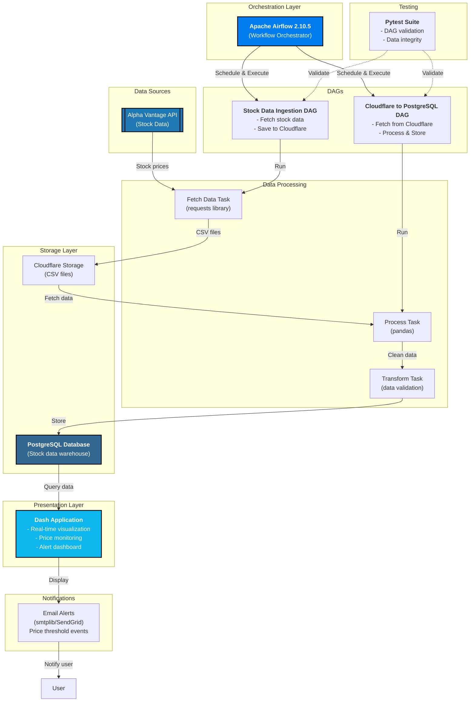

# Real-time Stock Price Analysis and Alerting

## Project Overview

This project provides a real-time stock price analysis and alerting system. It fetches stock data using the Alpha Vantage API, processes it with Python (using Pandas), stores it in a local PostgreSQL database, and sends email notifications when the stock price crosses user-defined thresholds. The entire workflow is orchestrated using Apache Airflow.

## System Architecture



### Data Flow Summary

1. **Data Ingestion**: Daily scheduled DAG fetches stock data from Alpha Vantage API
2. **Cloud Storage**: Raw data is uploaded to Cloudflare storage as backup
3. **ETL Processing**: Second DAG retrieves data from Cloudflare, processes with Pandas, and validates
4. **Data Warehouse**: Processed data stored in PostgreSQL for analysis
5. **Visualization**: Dash web application queries PostgreSQL and displays real-time insights
6. **Alerting**: System triggers email alerts when stock prices cross configured thresholds
7. **Testing**: Continuous validation through pytest test suite

## Features

* **Real-time Stock Data:** Fetches real-time stock prices using the Alpha Vantage API.
* **Data Processing:** Processes and analyzes stock data using Pandas.
* **Data Storage:** Stores stock data in a local PostgreSQL database.
* **Workflow Orchestration:**  Manages the entire workflow using Apache Airflow for scheduling and automation.
* **Alerting:** Sends email alerts via Python's `smtplib` (or SendGrid) when stock prices cross predefined thresholds.

## Technologies Used

* **Programming Language:** Python 3.12.8 (required for Airflow 2.10.5)
* **Data Ingestion:** `requests` library for API calls
* **Data Processing:** `pandas` library for data manipulation and analysis
* **Data Storage:** PostgreSQL database
* **Workflow Orchestration:** Apache Airflow 2.10.5
* **Alerting:** `smtplib` (or SendGrid) for email notifications
* **Virtual Environment:** `venv` 
* **Package Management:** `pip`

## Setup

### 1. Prerequisites

* **Python:** Downgrade to Python 3.12.8 using `pyenv`:
    ```bash
    pyenv install 3.12.8
    pyenv global 3.12.8
    ```

* **Java:** Install Java:
    ```bash
    # Example for macOS
    brew install java
    ```

* **PostgreSQL:** Install PostgreSQL:
    ```bash
    # Example for macOS
    brew install postgresql
    ```

### 2. Obtain an API Key

1. Create an account on [Alpha Vantage](https://www.alphavantage.co/).
2. Obtain your API key from the Alpha Vantage website.

### 3. Set Up the Virtual Environment

1. Create and activate the virtual environment:
    ```bash
    python -m venv venv
    source venv/bin/activate  # On Linux/macOS
    ```

2. Install Apache Airflow 2.10.5:
    ```bash
    pip install 'apache-airflow==2.10.5' --constraint "[https://raw.githubusercontent.com/apache/airflow/constraints-2.10.5/constraints-3.12.txt](https://raw.githubusercontent.com/apache/airflow/constraints-2.10.5/constraints-3.12.txt)"
    ```

> Note: The project will setup using `astro dev init` which is very handy in this case
3. Run Astro CLI:
    ```bash
    astro dev init
    astro dev start
    ```

## 4. Tests:
```bash
PYTHONPATH=$PYTHONPATH:/full/path/to/project/stock-analysis pytest -s tests/dags/test_stock_dags.py
```
## Project Structure

```
stock-analysis-and-alerts/
  api/                          # FastAPI REST endpoints
    main.py                     # Main application
    schemas.py                  # Request/response models
    routes/                     # API route handlers
      stocks.py                 # Stock data endpoints
      alerts.py                 # Alert management endpoints
      watchlist.py              # Watchlist endpoints
      health.py                 # Health check endpoints
  
  models/                       # SQLAlchemy ORM models
    stock.py                    # Database models (StockData, Alert, UserWatchlist)
  
  indicators/                   # Technical analysis modules
    technical.py                # Technical indicators (RSI, MACD, Bollinger Bands, etc.)
    risk_metrics.py             # Risk calculations (Sharpe, Drawdown, Volatility, etc.)
  
  services/                     # Business logic layer
    database.py                 # Database operations and queries
    email_alert.py              # Email notification service
  
  utils/                        # Helper utilities
    helpers.py                  # Data validation, formatting, calculations
  
  dash_app/                     # Dash web application
    app.py                      # Main dashboard application
  
  dags/                         # Apache Airflow DAGs
    major_dags/                 # Main workflow definitions
    utils/                      # Shared configurations
  
  tests/                        # Unit tests
    indicators/                 # Tests for indicators and risk metrics
    dags/                       # Tests for Airflow DAGs
  
  k8s/                          # Kubernetes manifests (deployment-ready)
    api-deployment.yaml         # API deployment config
    postgres-statefulset.yaml   # Database config
    configmap-secrets.yaml      # Configuration management
    ingress.yaml                # External access config
  
  .github/workflows/            # CI/CD workflows (symbolic, non-executing)
    tests.yml                   # Test workflow
    lint.yml                    # Code quality workflow
    docker.yml                  # Docker build workflow
  
  Dockerfile                    # Container image definition
  docker-compose.yml            # Local development environment
  setup.py                      # Python package setup
```

## Quick Start (Local Development)

### Using Docker Compose (Recommended)

1. Copy environment template:
   ```bash
   cp .env.example .env
   ```

2. Update `.env` with your credentials (API keys, database password, etc.)

3. Start all services:
   ```bash
   docker-compose up -d
   ```

4. Access the applications:
   - API: [http://localhost:8000](http://localhost:8000)
   - API Docs: [http://localhost:8000/docs](http://localhost:8000/docs)
   - Dash Dashboard: [http://localhost:8050](http://localhost:8050)
   - PostgreSQL: `localhost:5432`

5. Stop services:
   ```bash
   docker-compose down
   ```

### Manual Setup

1. Create virtual environment:
   ```bash
   python -m venv venv
   source venv/bin/activate  # On Windows: venv\Scripts\Activate.ps1
   ```

2. Install dependencies:
   ```bash
   pip install -r requirements.txt
   ```

3. Set up PostgreSQL and configure `.env`

4. Run API:
   ```bash
   uvicorn api.main:app --reload
   ```

5. Run Dashboard:
   ```bash
   python dash_app/app.py
   ```

## API Documentation

The REST API provides comprehensive endpoints for stock analysis, alerts, and watchlists:

### Available Endpoints

**Stocks:**
- `GET /api/stocks` - Get all stocks
- `GET /api/stocks/{symbol}` - Get stock current price
- `GET /api/stocks/{symbol}/history` - Get price history
- `GET /api/stocks/{symbol}/indicators` - Get technical indicators
- `GET /api/stocks/{symbol}/risk-metrics` - Get risk metrics

**Alerts:**
- `GET /api/alerts` - List all alerts
- `POST /api/alerts` - Create new alert
- `PUT /api/alerts/{alert_id}` - Update alert
- `DELETE /api/alerts/{alert_id}` - Delete alert

**Watchlist:**
- `GET /api/watchlist/{user_id}` - Get user watchlist
- `POST /api/watchlist` - Add stock to watchlist
- `DELETE /api/watchlist/{user_id}/{symbol}` - Remove from watchlist

**Health:**
- `GET /health` - System health check
- `GET /status` - System status

Interactive API documentation available at `/docs` when running the API server.

## Module Reference

### Indicators (indicators/)

**Technical Indicators:**
```python
from indicators import TechnicalIndicators

rsi = TechnicalIndicators.rsi(prices, period=14)
macd, signal, hist = TechnicalIndicators.macd(prices)
upper, middle, lower = TechnicalIndicators.bollinger_bands(prices)
```

**Risk Metrics:**
```python
from indicators import RiskMetrics

sharpe = RiskMetrics.sharpe_ratio(returns)
max_dd = RiskMetrics.max_drawdown(prices)
volatility = RiskMetrics.volatility(returns)
```

### Services (services/)

**Database Operations:**
```python
from services import DatabaseService

db = DatabaseService()
data = db.get_stock_data('AAPL', limit=100)
db.insert_stock_data(dataframe)
alert_id = db.create_alert('AAPL', 'price_threshold', 150.0, 149.50)
```

**Email Alerts:**
```python
from services import EmailAlertService

email = EmailAlertService()
email.send_price_alert('AAPL', 152.30, 150.00, 'above', 'user@example.com')
```

### Utils (utils/)

**Data Validation:**
```python
from utils.helpers import DataValidator

is_valid, msg = DataValidator.validate_stock_data(df)
outliers = DataValidator.check_outliers(df, column='close')
```

**Formatting:**
```python
from utils.helpers import DataFormatter

price = DataFormatter.format_currency(152.30)  # "$152.30"
pct = DataFormatter.format_percentage(0.05)    # "5.00%"
```

See [QUICK_REFERENCE.txt](QUICK_REFERENCE.txt) for complete API reference.

## Running Tests

```bash
# Run all tests
pytest tests/ -v

# Run specific test file
pytest tests/indicators/test_technical.py -v

# Run with coverage
pytest tests/ --cov=indicators --cov=services --cov-report=html
```

## Documentation

- [QUICK_REFERENCE.txt](QUICK_REFERENCE.txt) - API quick reference and module examples
- [ADDITIONS_SUMMARY.txt](ADDITIONS_SUMMARY.txt) - Summary of added modules and features
- [DEPLOYMENT_GUIDE.txt](DEPLOYMENT_GUIDE.txt) - Deployment infrastructure guide
- [docs/NEW_MODULES_GUIDE.md](docs/NEW_MODULES_GUIDE.md) - Detailed module documentation

## Deployment

The project includes deployment-ready infrastructure:

- **Docker:** Single Dockerfile for containerization
- **Docker Compose:** Local development environment
- **Kubernetes:** K8s manifests for production deployment
- **CI/CD:** GitHub Actions workflows for automated testing

See [DEPLOYMENT_GUIDE.txt](DEPLOYMENT_GUIDE.txt) for detailed deployment instructions.

## Contributing

1. Create a feature branch: `git checkout -b feature/your-feature`
2. Make changes and run tests: `pytest tests/`
3. Commit with descriptive message: `git commit -m "feat: add your feature"`
4. Push and create pull request

## License

MIT License - See LICENSE file for details

## Contact

Victor Preston - [prestonvictor25@gmail.com](mailto:prestonvictor25@gmail.com)

Project Repository: [github.com/victorpreston/stock-analysis-and-alerts](https://github.com/victorpreston/stock-analysis-and-alerts)