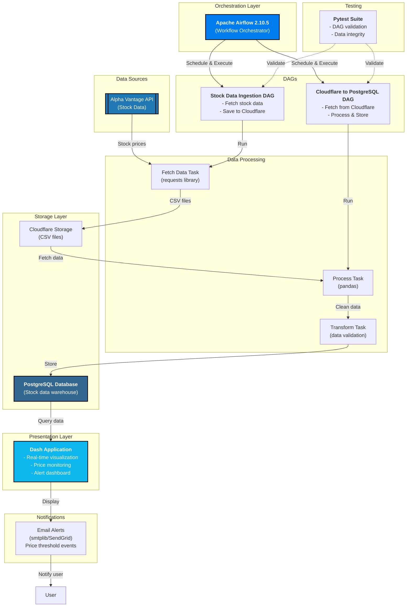

# Real-time Stock Price Analysis and Alerting

## Project Overview

This project provides a real-time stock price analysis and alerting system. It fetches stock data using the Alpha Vantage API, processes it with Python (using Pandas), stores it in a local PostgreSQL database, and sends email notifications when the stock price crosses user-defined thresholds. The entire workflow is orchestrated using Apache Airflow.

## System Architecture



### Data Flow Summary

1. **Data Ingestion**: Daily scheduled DAG fetches stock data from Alpha Vantage API
2. **Cloud Storage**: Raw data is uploaded to Cloudflare storage as backup
3. **ETL Processing**: Second DAG retrieves data from Cloudflare, processes with Pandas, and validates
4. **Data Warehouse**: Processed data stored in PostgreSQL for analysis
5. **Visualization**: Dash web application queries PostgreSQL and displays real-time insights
6. **Alerting**: System triggers email alerts when stock prices cross configured thresholds
7. **Testing**: Continuous validation through pytest test suite

## Features

* **Real-time Stock Data:** Fetches real-time stock prices using the Alpha Vantage API.
* **Data Processing:** Processes and analyzes stock data using Pandas.
* **Data Storage:** Stores stock data in a local PostgreSQL database.
* **Workflow Orchestration:**  Manages the entire workflow using Apache Airflow for scheduling and automation.
* **Alerting:** Sends email alerts via Python's `smtplib` (or SendGrid) when stock prices cross predefined thresholds.

## Technologies Used

* **Programming Language:** Python 3.12.8 (required for Airflow 2.10.5)
* **Data Ingestion:** `requests` library for API calls
* **Data Processing:** `pandas` library for data manipulation and analysis
* **Data Storage:** PostgreSQL database
* **Workflow Orchestration:** Apache Airflow 2.10.5
* **Alerting:** `smtplib` (or SendGrid) for email notifications
* **Virtual Environment:** `venv` 
* **Package Management:** `pip`

## Setup

### 1. Prerequisites

* **Python:** Downgrade to Python 3.12.8 using `pyenv`:
    ```bash
    pyenv install 3.12.8
    pyenv global 3.12.8
    ```

* **Java:** Install Java:
    ```bash
    # Example for macOS
    brew install java
    ```

* **PostgreSQL:** Install PostgreSQL:
    ```bash
    # Example for macOS
    brew install postgresql
    ```

### 2. Obtain an API Key

1. Create an account on [Alpha Vantage](https://www.alphavantage.co/).
2. Obtain your API key from the Alpha Vantage website.

### 3. Set Up the Virtual Environment

1. Create and activate the virtual environment:
    ```bash
    python -m venv venv
    source venv/bin/activate  # On Linux/macOS
    ```

2. Install Apache Airflow 2.10.5:
    ```bash
    pip install 'apache-airflow==2.10.5' --constraint "[https://raw.githubusercontent.com/apache/airflow/constraints-2.10.5/constraints-3.12.txt](https://raw.githubusercontent.com/apache/airflow/constraints-2.10.5/constraints-3.12.txt)"
    ```

> Note: The project will setup using `astro dev init` which is very handy in this case
3. Run Astro CLI:
    ```bash
    astro dev init
    astro dev start
    ```

## 4. Tests:
```bash
PYTHONPATH=$PYTHONPATH:/full/path/to/project/stock-analysis pytest -s tests/dags/test_stock_dags.py
```
